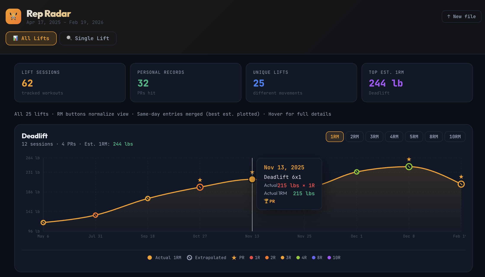
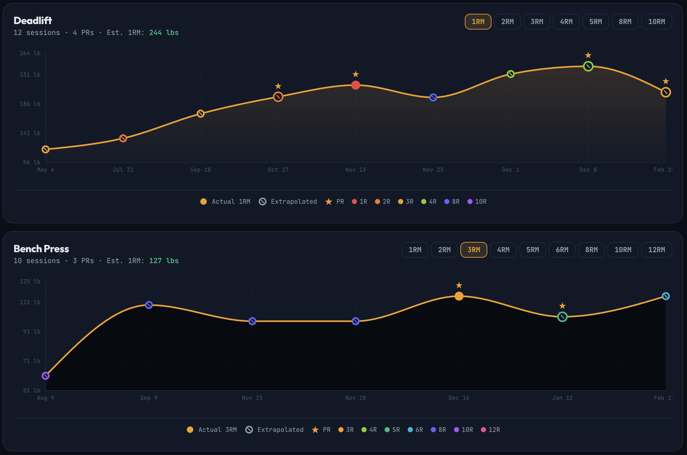
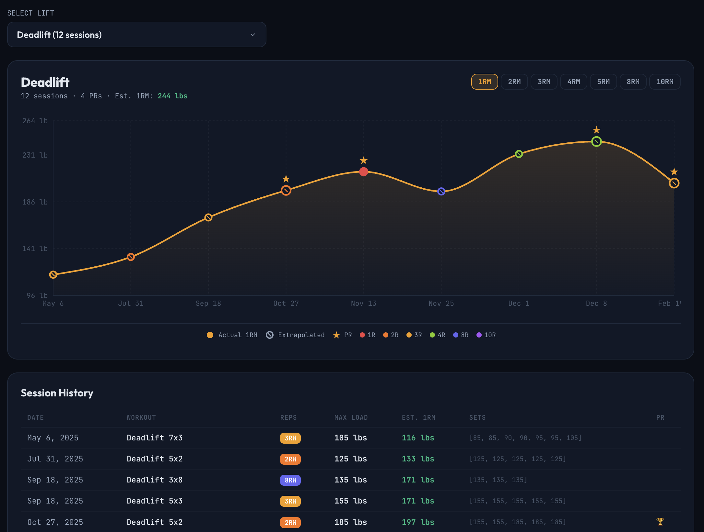

# Rep Radar

Upload your workout CSV export and get interactive lift progression charts with rep-max normalization.

**Live app → [rep-radar-alpha.vercel.app](https://rep-radar-alpha.vercel.app)**

---

## Screenshots

### Summary Dashboard — all lifts at a glance





### Single Lift — drill down with session history



---

## What it does

- **Upload** a CSV export from your workout tracking app (SugarWod supported today)
- **Visualize** every barbell lift as a time-series chart
- **Normalize** across different rep schemes using the Epley formula — compare your 3-rep deadlift sessions directly against your 5-rep sessions on the same chart
- **Track PRs** — personal records are highlighted with a star marker on the chart
- **Drill down** into any lift with a session history table and per-set load breakdown

## Privacy

> **Your data never leaves your device.**
>
> Rep Radar is a fully client-side app — there is no server, no database, and no analytics on your workout data. When you upload a CSV, it is parsed entirely in your browser. Nothing is transmitted anywhere. Closing the tab discards everything.

## Try it with sample data

A real SugarWod export is included at [`sample/sugarwod-sample.csv`](sample/sugarwod-sample.csv) if you want to try the app without your own data.

## Supported sources

| Source | Status |
|---|---|
| SugarWod | Supported |
| BTWB | Planned |
| Wodify | Planned |
| TrainHeroic | Planned |

## How to export from SugarWod

1. Open SugarWod on your phone or web browser
2. Go to Profile → Settings → "Export Data"
3. Tap "Export Workouts" and save the CSV file
4. Upload that file at [rep-radar-alpha.vercel.app](https://rep-radar-alpha.vercel.app)

## How the normalization works

Rep Radar uses the **Epley formula** to estimate equivalent loads across different rep counts:

```
Est. 1RM  = weight × (1 + reps / 30)
Est. N-RM = Est. 1RM / (1 + N / 30)
```

This lets you pick any target rep count (1RM, 3RM, 5RM, …) and see all your sessions normalized to that rep scheme — even when the actual workouts used different rep schemes. Dots on the chart are filled when the session exactly matches the selected rep count, and hollow (with a slash) when the value is extrapolated.

## Tech

- [Vite](https://vite.dev) + [React](https://react.dev)
- [Recharts](https://recharts.org) — charting
- [Papaparse](https://www.papaparse.com) — CSV parsing
- Deployed on [Vercel](https://vercel.com) as a static site

## Local development

```bash
npm install
npm run dev
```

## Adding a new workout source

Rep Radar uses an adapter pattern. Adding a new source is one file:

1. Create `src/adapters/<source>.js` exporting `meta` and `parse(csvString) → LiftEntry[]`
2. Register it in `src/adapters/index.js`

See `CLAUDE.md` for the full adapter contract and `LiftEntry` schema.
